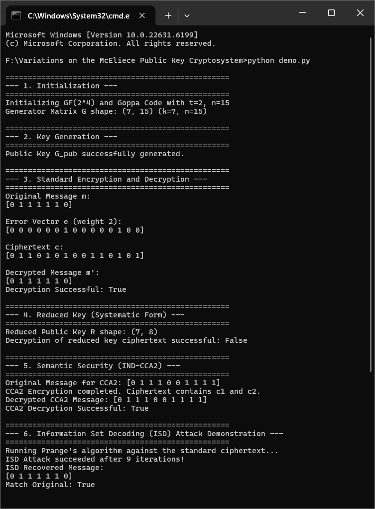
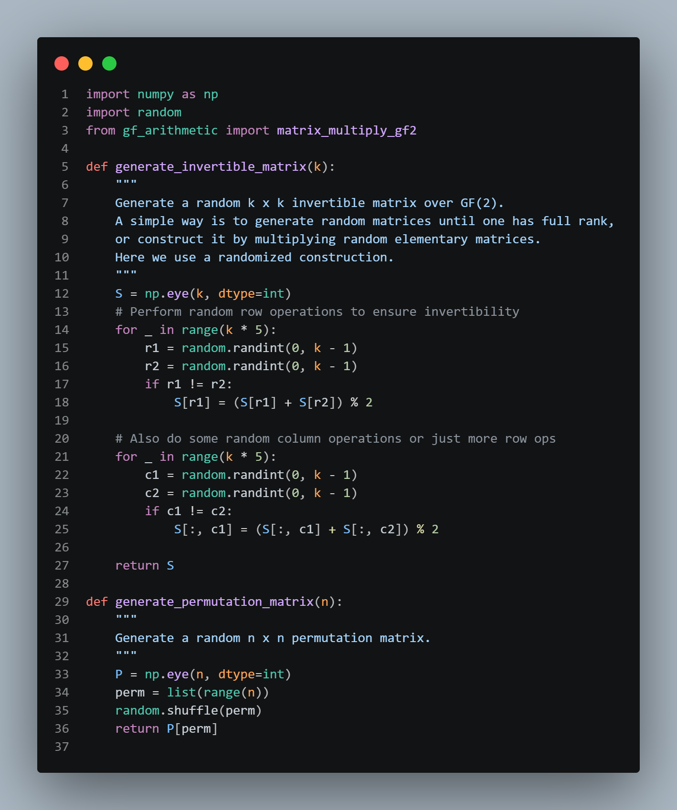
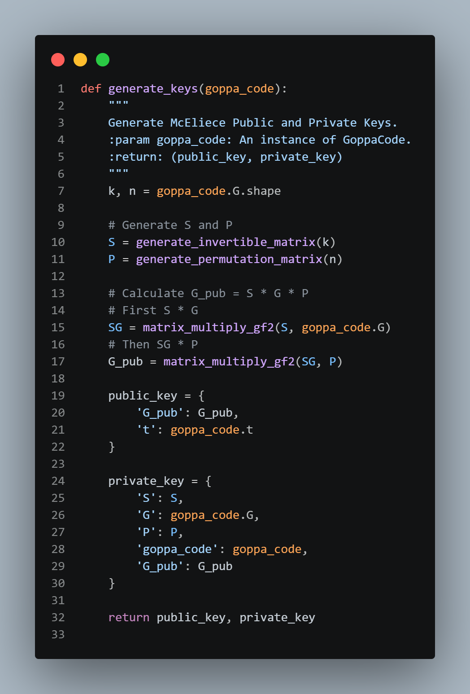
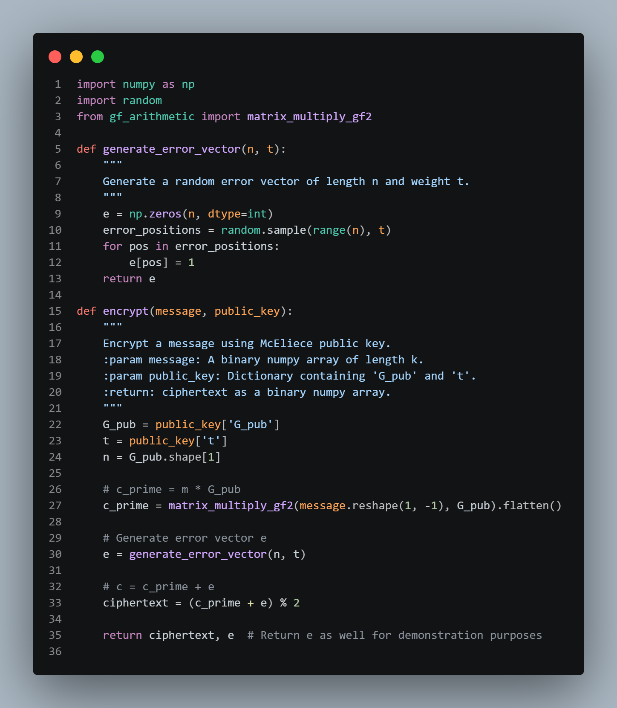
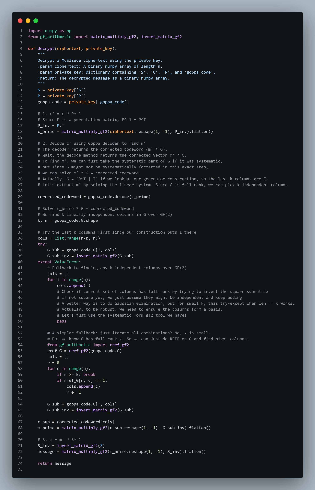
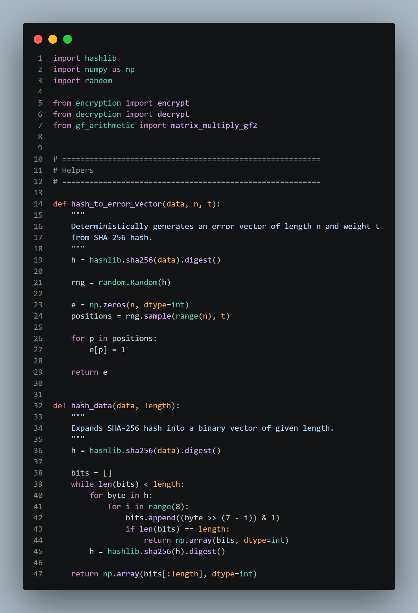
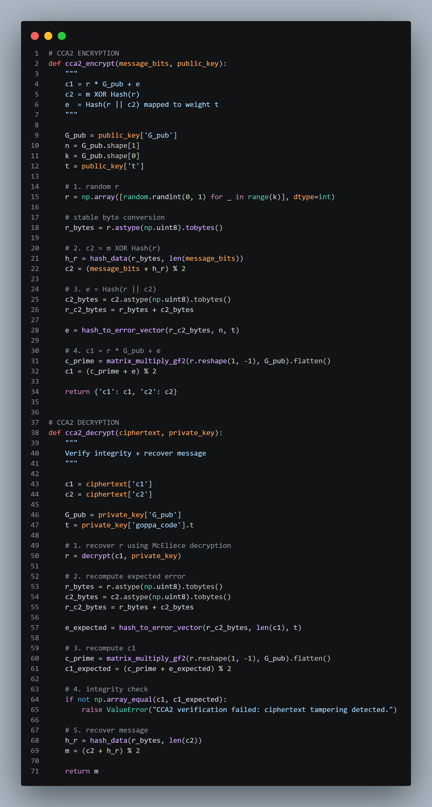
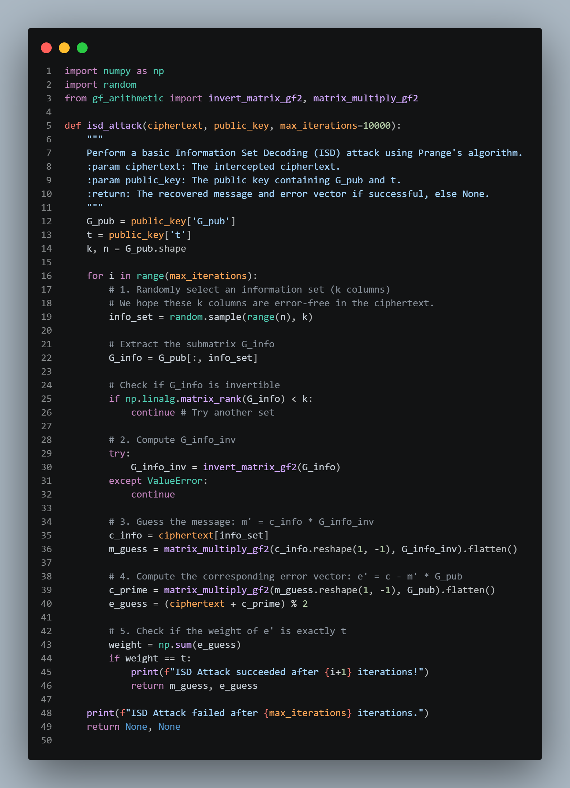

# McEliece Public Key Cryptosystem Variations 🔐

Welcome to the McEliece Cryptosystem project! This repository provides an educational, in-depth implementation of the McEliece public-key cryptosystem along with its modern variations, an interactive web interface, and security analysis tools.

## 🌟 Features
- **Standard McEliece Cryptosystem**: Built from scratch using Galois Fields and binary Goppa codes.
- **Niederreiter and Systematic Form**: Reduced public key sizes for improved efficiency.
- **Semantic Security (IND-CCA2)**: Robust padding schemes to protect against adaptive chosen-ciphertext attacks.
- **Information Set Decoding (ISD)**: A built-in implementation of the ISD attack to demonstrate the cryptosystem's security boundaries.
- **Web Interface (API & SPA)**: A Flask backend with an interactive frontend to explore the cryptosystem visually.

---

## 📸 Demonstrations & Web API

This project comes with an interactive web UI and a command-line demonstration. 

You can launch the web API using:
```bash
python app.py
```
And run the full CLI demonstration using:
```bash
python main.py
```

### Overall Execution & Output
The project provides complete transparency into the execution steps, from field initialization to CCA2-secure encryption.


---

## 🔑 Key Generation
The key generation process initializes the Galois Field ($GF(2^m)$) and generates a random Goppa code, returning both the public and private key matrices.




---

## 🔒 Encryption
The standard encryption process multiplies the message vector with the public generator matrix and adds a random error vector.



---

## 🔓 Decryption
Using the private key (the Goppa polynomial and permutation matrices), the receiver can effectively identify and correct the added errors to recover the original message.



---

## 🛡️ Semantic Security (IND-CCA2)
The standard McEliece cryptosystem is vulnerable to chosen-ciphertext attacks. This project implements a CCA2-secure variant using random padding and hashing to ensure robust semantic security.




---

## ⚔️ Information Set Decoding (ISD) Attack
To understand the security of the cryptosystem, this repository includes an Information Set Decoding (ISD) attack simulation. This demonstrates how an attacker attempts to find the error vector and recover the message from the public key and ciphertext.



---

## ⚙️ Requirements

Ensure you have Python 3.8+ installed. You can install all dependencies via the provided `requirements.txt`:

```bash
pip install -r requirements.txt
```

**Core Dependencies:**
- `numpy`
- `Flask`
- `flask-cors`
- `galois`

## 🚀 Getting Started
1. Clone this repository to your local machine.
2. Install the necessary dependencies.
3. Run `python main.py` to see the terminal-based breakdown of the math and crypto operations.
4. Or, start the web server with `python app.py` and open `http://localhost:5000` in your browser.
